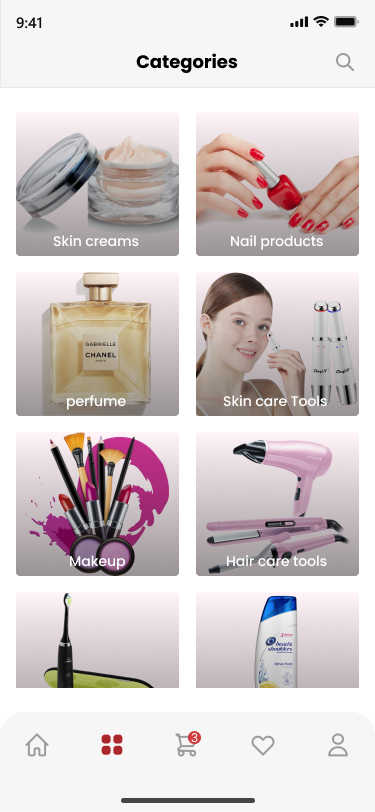
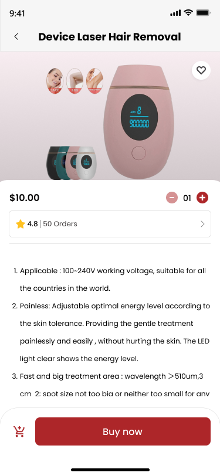
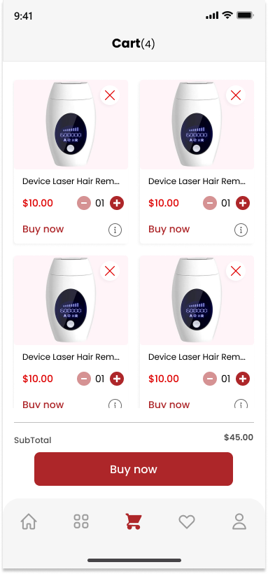

# Beauty Products Store App

## Project Title
Beauty Products Store Application

---

## Description
This project is a mobile application designed for selling beauty and skincare products.  
It provides users with a clean and simple interface to browse different cosmetic items such as makeup, skincare products, perfumes, and beauty accessories.

The application simulates a modern online shopping experience using a structured layout based on product categories and detailed product views. The main goal is to practice building UI using Jetpack Compose and applying OOP principles in Android development.

---

## Technologies Used
- Kotlin
- Jetpack Compose
- Object-Oriented Programming (OOP)
- Android Studio
- Material Design
- State Management in Compose

---

## Features
- Home screen displaying product categories
- Product listing using cards
- Product details page with full information
- Shopping cart page
- Clean and responsive UI design
- Organized and modular project structure

---

## Screenshots

### Categories Page

### Product Details Page

### Cart Page

---

## How to Run
1. Clone the repository:
git clone https://github.com/EmadHamdan1/github-training-project.git

2. Open the project in Android Studio

3. Sync Gradle files

4. Run the application on an emulator or physical device

---

## Project Structure
- Main screens are built using Jetpack Compose
- Each screen is separated into its own composable functions
- Clean architecture with separation of UI and logic

---

## Student Name
Imad Hamdan
